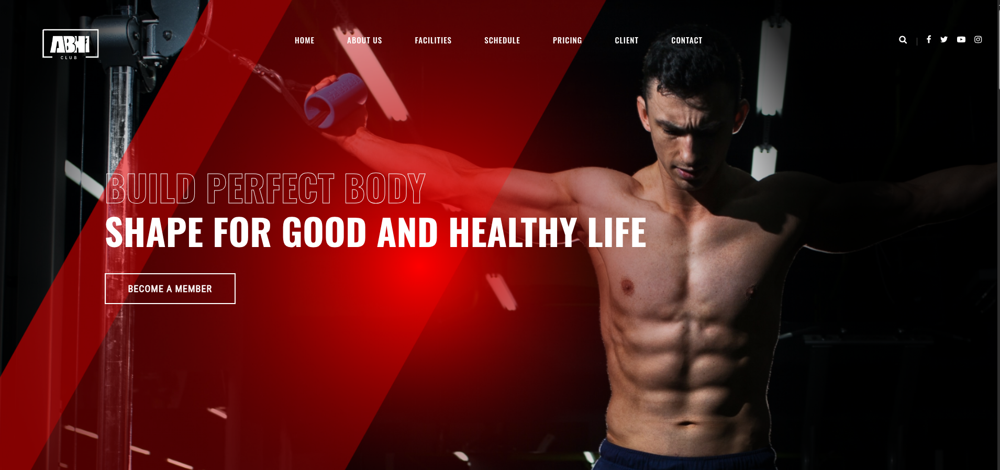
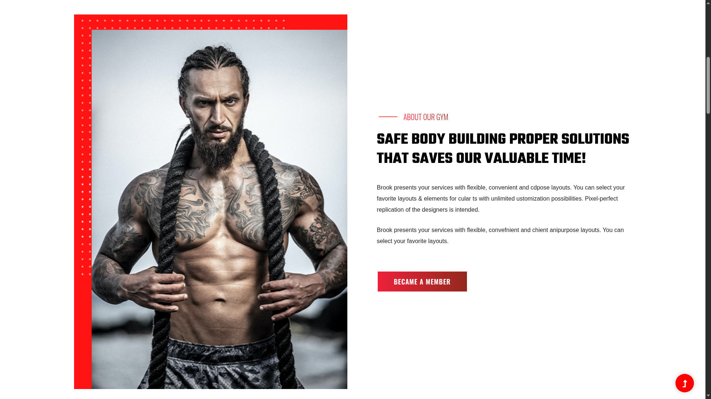
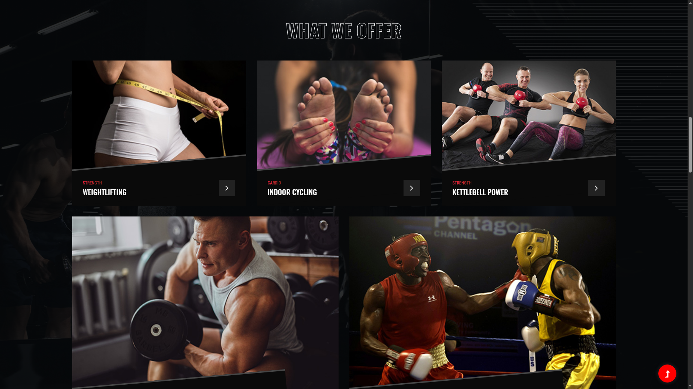
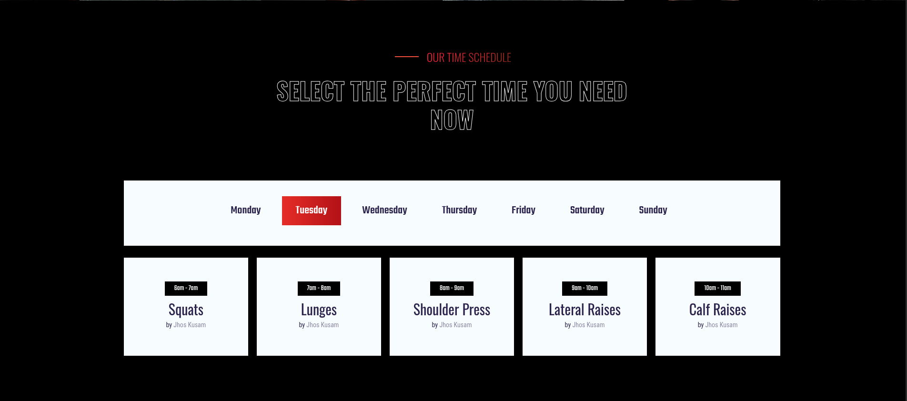
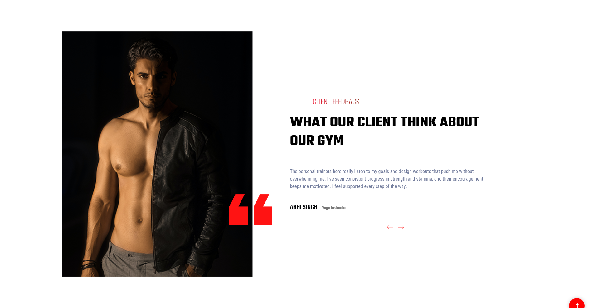

# Fitness Club Front-End Website

Welcome to the **Fitness Club Front-End** repository! This project showcases a modern, responsive website designed for a fitness club, featuring a clean layout, user-friendly navigation, and essential information for potential members.

## 🚀 Live Demo

Experience the website live here:
👉 [https://anodeus.github.io/fitness\_club/index.html](https://anodeus.github.io/fitness_club/index.html)

## 📁 Project Structure

The repository contains the following files and directories:

* `index.html`: The main homepage of the fitness club website.
* `become_member.html`: A page detailing membership options and registration.
* `assets/`: Directory containing images, stylesheets, and scripts.
* `README.md`: This file, providing an overview of the project.

## 🎨 Features

* **Responsive Design**: Optimized for both desktop and mobile devices.
* **Modern UI**: Clean and intuitive user interface for seamless navigation.
* **Membership Plans**: Detailed information on various membership options.
* **Class Schedule**: Weekly timetable for fitness classes.
* **Client Testimonials**: Feedback from members highlighting their experiences.

## 🛠️ Technologies Used

* **HTML5**: For structuring the content.
* **CSS3**: For styling and layout.
* **JavaScript**: For interactive elements (if applicable).


## 📸 Website Highlights


*The homepage hero section with a welcoming message and call-to-action.*


*Overview of fitness classes with timings and schedules.*


*Meet our professional trainers and staff.*


*Feedback from members sharing their experience.*


*Contact form and footer with social links and additional information.*

*Contact form and footer with social links and additional information.*

*Contact form and footer with social links and additional information.*

*Contact form and footer with social links and additional information.*


---

## 📸 Website Highlights


*The homepage featuring the navigation bar and hero section with a welcoming message.*


*Overview of the fitness club, mission, and introduction to the services.*


*Special offers, promotions, and membership deals available.*


*Meet our professional trainers and staff.*


*Weekly schedule for all fitness classes.*


*Feedback from members sharing their experiences.*


*Footer with contact information, social links, and additional resources.*

---


## 📌 How to Use

1. Clone the repository:

   ```bash
   git clone https://github.com/anodeus/fitness_club.git
   ```

2. Navigate to the project directory:

   ```bash
   cd fitness_club
   ```

3. Open `index.html` in your preferred web browser to view the website locally.

## 📄 License

This project is licensed under the MIT License - see the [LICENSE](LICENSE) file for details.

## 📬 Contact

For any questions or feedback, feel free to open an issue in the repository or contact me directly.

